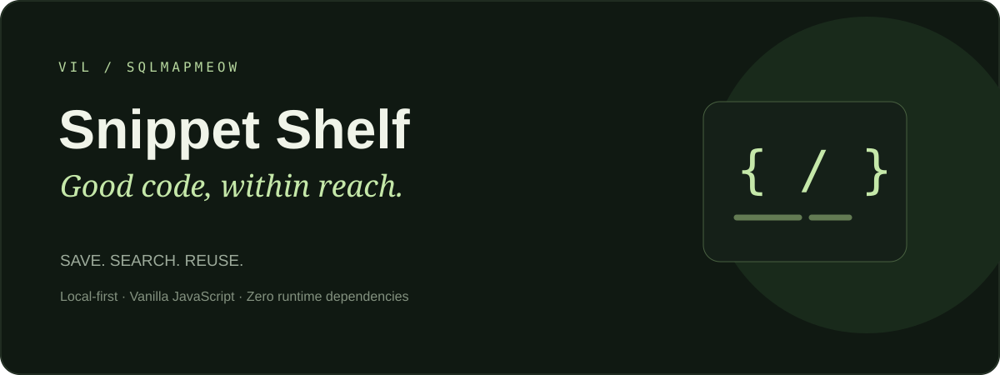

<p align="center"></p>

# Snippet Shelf

A local-first library for the code you want to keep. Built with vanilla JavaScript, HTML and CSS. No build step or third-party runtime dependencies.

## Features

- Create, edit, duplicate and organize code snippets.
- Search titles, descriptions, tags and code with multiple search terms.
- Filter by language, collect favorites and sort by title or last edit.
- Copy code, or manually copy selected text when clipboard access is unavailable.
- Delete with confirmation and undo until the next change.
- Export a JSON backup and import it without replacing existing snippets. Identical content is skipped; conflicting IDs are regenerated.
- Recover unreadable storage by downloading its raw contents before resetting.
- Responsive dark interface, keyboard-accessible controls and a `/` search shortcut.

Six editable example snippets are included on first launch. They are sample content, not personal usage history. Code is displayed as plain text and never executed.

## Run locally

Open `index.html` in a modern browser for a quick look. For a consistent browser-storage origin, use Node.js 20 or newer:

```sh
npm start
```

Open http://127.0.0.1:4174. There is nothing to install. Stop the local server with Ctrl+C.

## Privacy and storage

Your first change saves the shelf in this browser's localStorage. This app does not send snippets to a server. There are no accounts, analytics or synchronization. If storage is unavailable, an explicit session-only mode allows editing, but you must export before closing the tab.

Local storage is not encrypted and this is not a secrets vault. Other scripts on the same origin may access it. Different GitHub Pages projects under the same username share an origin. Do not store passwords, private keys or production credentials.

Clearing browser data removes saved snippets. Changing browser, origin or device does not transfer them: export and import a backup. Storage behavior for directly opened files varies by browser; the local server is preferred.

Changes detected from another tab are loaded automatically unless an editor is open. Saves check for changed storage before writing. This is not a transactional multi-user database; avoid simultaneous edits in multiple tabs.

## Limits

Up to 500 snippets, 50,000 JavaScript string characters per code field, eight tags per snippet, and a 2 MiB serialized backup. Browser storage quotas can be lower. The line-number gutter displays up to 5,000 lines; code itself is not truncated. No syntax highlighting or code execution is included.

## Tests

```sh
npm test
```

13 Node tests cover exact code preservation, input validation, search, sorting, additive imports, ID collisions, storage conflicts and write failures. These tests pass. Automated browser layout and interaction tests have not been run in the build environment. See `docs/manual-checklist.md` for browser checks before publishing.

## Project structure

```text
index.html             Interface and dialogs
style.css              Responsive dark theme
src/core.js            Validation, searching, backups and storage rules
src/examples.js        Six starter examples
src/app.js             UI and browser interactions
server.cjs             Optional local development server
tests/core.test.cjs    Dependency-free Node tests
```

<div align="center">
  <sub>SiteSentry · sqlmapmeow</sub>
</div>
